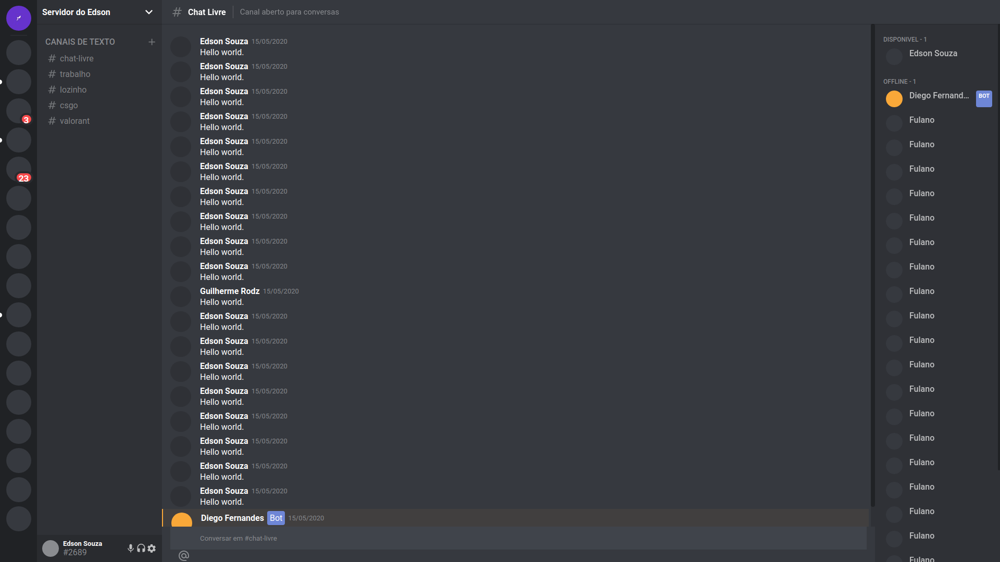

<h1 align="center">
 
  <h1 align="center">Clone of discord</h1>
 

</h1>

  

## Overview

This project were built to trainern ability in React and typescript.

## Web

## Feature

- ⚛️ **React Js** — A JavaScript library for building user interfaces
- Typescript — TypeScript is an open-source language which builds on JavaScript, one of the world’s most used tools, by adding static type definitions.

## Getting started

### Debian and derivatives
<ol>
    <li>
        Unzip the download
    </li>
    <li>
        Run the command cd clone_discord
    </li>    
    <li>
        Run yarn
    </li>
    <li>
        Run the command yarn start or npm run start
    </li>
</ol>

## License

This project is licensed under the MIT License - see the [LICENSE](https://opensource.org/licenses/MIT) page for details.